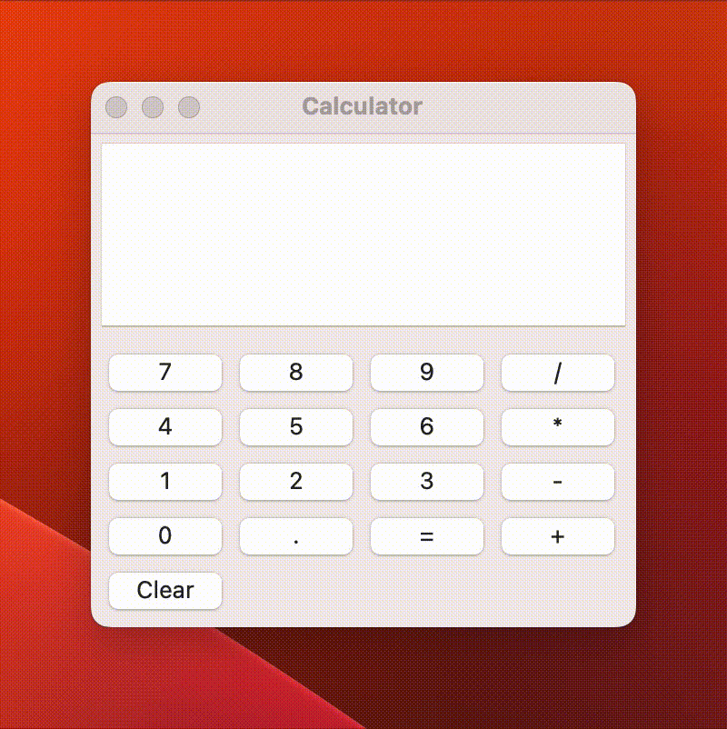
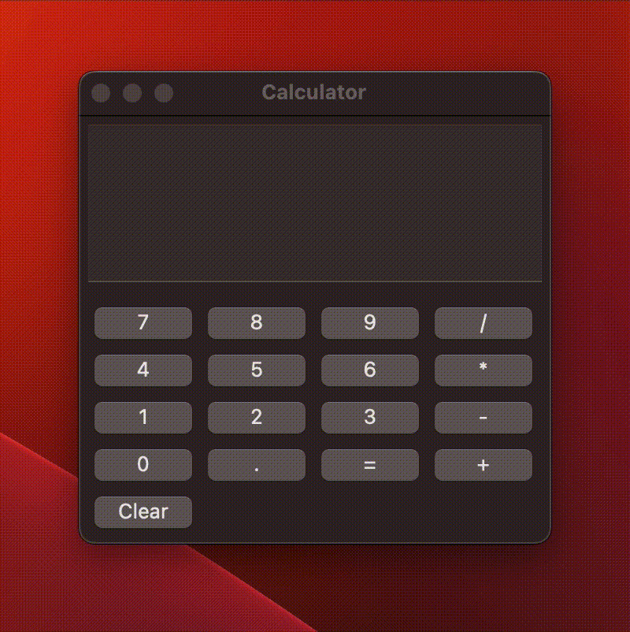

# wxPython Calculator

This is a simple calculator application built with wxPython. It provides basic arithmetic operations such as addition, subtraction, multiplication, and division.

  
   

## Getting Started

To get started with this project, follow the instructions below:

1. **Clone the Repository**

    You can clone this repository by running `git clone https://github.com/owenthcarey/wxpython-calculator.git`

2. **Set up a Python Environment**

    It's recommended to run this application in a virtual environment to isolate the project dependencies. Here are the steps to set up the environment:

    - Deactivate your virtual environment if it's currently active by running the command: `deactivate`
    - Remove the existing virtual environment: `rm -r venv/`
    - Create a new virtual environment using the `--system-site-packages` option: `python3 -m venv --system-site-packages venv/`
    - Activate the new virtual environment: `source venv/bin/activate`

    > Note: These steps are specifically required for MacOS users due to an issue with running wxPython applications in non-framework builds of Python. If you're not on MacOS or if your Python build doesn't cause the issue, you can create the virtual environment with the usual `python3 -m venv venv/` command.

3. **Install Dependencies**

    Once your virtual environment is activated, install the project dependencies by running `pip install -r requirements.txt`

4. **Run the Application**

    To run the calculator application, execute the following command: `python main.py`

## Features

This calculator can perform the following operations:

- Addition
- Subtraction
- Multiplication
- Division

Press the `Clear` button to clear the input field.
